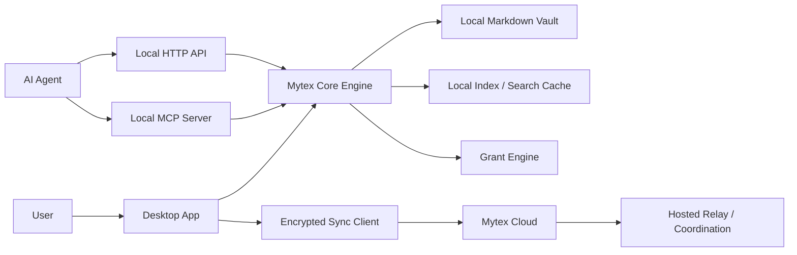

# Mytex Architecture Review

Mytex is a local-first, open core context management system for people who want to define, manage, and transport living context about themselves across AI agents.

The product promise is simple: Mytex is API and AI documentation, but for you. It gives users a portable personal context profile that they own, inspect, back up, and selectively connect to agents without reteaching every new AI system who they are, what they are working on, what they care about, or what boundaries apply.

## Guiding Principles

- User first: users own their context, choose where it lives, and control who can access it.
- Easy for everyone: the main experience should feel like managing a profile, not operating infrastructure.
- Simple over fancy: use durable primitives like files, Markdown, explicit grants, and small services before complex platforms.
- Always secure: least privilege, local-first defaults, auditable access, and clear privacy tradeoffs should shape every major decision.

## Architecture Decisions

The recommended v1 direction is protocol-first and local-first.

- Define a public Mytex profile specification before overfitting the product to one app or cloud backend.
- Store the canonical profile as a portable folder of Markdown files with structured metadata.
- Build a desktop app that makes the profile approachable for non-technical users.
- Ship a local API and MCP server so agents can connect to the profile through controlled access, not raw files.
- Offer paid cloud sync and hosted coordination without requiring Mytex cloud to hold plaintext user context.
- Keep individual users as the visible v1 product while designing internal ownership and grant models that can later support teams.

Chosen defaults:

- MVP shape: protocol/library first.
- Storage model: plain folder plus Git-compatible versioning.
- Desktop stack: Tauri with a TypeScript UI and Rust local services.
- Integration access: scoped capability grants per agent or external system.
- Cloud trust model: client-side encrypted sync.
- Hosted access: no offline cloud decryption in v1.
- Teams path: hidden owner/workspace/grant foundations, individual-only UI at first.

## System Overview

Mytex should be organized around a shared core engine rather than several separate implementations of the same rules.



Core components:

- Profile specification: the versioned folder, document, metadata, and relationship model.
- Core engine: parsing, validation, indexing, search, graph traversal, grant enforcement, audit logging, and sync packaging.
- Desktop app: user-facing profile editor, grant manager, sync controls, and audit viewer.
- Local API: a loopback-only HTTP service for trusted local integrations.
- MCP server: the primary AI agent integration surface.
- Cloud service: encrypted sync, backup, relay, device coordination, billing, and future account/team services.

The core engine should be the policy enforcement point. The app, API, MCP server, CLI, and future cloud clients should not each invent their own interpretation of profile access.

## Profile And Vault Model

The canonical Mytex profile should be a normal folder that a user can inspect, copy, back up, sync, or version. Markdown should be the source of truth because it is durable, readable, and friendly to tools like Obsidian.

Recommended v0 structure:

```text
mytex-profile/
  mytex.yaml
  context/
    identity/
    roles/
    goals/
    relationships/
    memories/
    tools/
    communication/
    preferences/
    domain-knowledge/
    decisions/
  attachments/
  .mytex/
    index/
    audit/
    grants/
```

`mytex.yaml` should identify the profile, schema version, supported features, default sensitivity settings, and local vault configuration. Context documents should use Markdown with YAML frontmatter for machine-readable metadata.

Example document frontmatter:

```yaml
---
id: ctx_goal_2026_company_launch
type: goal
title: Launch Mytex v1
sensitivity: private
tags: [mytex, product, founder-context]
status: active
updated_at: 2026-04-18
related:
  - ctx_role_founder
  - ctx_decision_local_first
---
```

Recommended first-class context categories:

- Identity
- Roles and responsibilities
- Current goals
- Relationships
- Memories
- Tools and systems
- Communication style
- Goals and priorities
- Preferences and constraints
- Domain knowledge
- Decisions

The system should allow custom collections, but the default templates should be opinionated enough that a new user is not staring at a blank vault.

Markdown files should support both standard Markdown links and wiki-style links. Mytex should maintain a derived local graph index, but the links in the files should remain meaningful outside the app.

## Local Application

The desktop app should be built with Tauri: a TypeScript frontend for the management experience and a Rust sidecar for local filesystem access, OS keychain integration, local services, and cryptography-sensitive work.

Primary app responsibilities:

- Create and open Mytex profiles.
- Provide friendly forms and templates for common context categories.
- Let users browse, edit, link, tag, and archive context documents.
- Manage agent grants.
- Show recent access and audit history.
- Start, stop, and configure the local API and MCP server.
- Manage encrypted cloud sync.

The app should feel like managing a living profile, not like editing a repository. Power users can still open the folder directly in an editor or Obsidian.

## Local API And MCP Server

Mytex should expose two local integration surfaces.

The MCP server is the primary agent interface. It should expose context as resources and tools, while enforcing grants before any content leaves the vault.

Recommended MCP capabilities:

- `mytex.search_context`: query allowed context by text, category, tag, sensitivity, recency, and relationship.
- `mytex.read_context`: fetch a specific allowed document or fragment by ID.
- `mytex.list_context`: list allowed categories, documents, tags, and graph neighborhoods.
- `mytex.propose_context_change`: submit a suggested edit for user review.

The local HTTP API should mirror the same read/search behavior for non-MCP clients and local tooling. It should bind to loopback by default and require explicit user action before any LAN or remote exposure.

Important rule: agents and integrations should never receive raw filesystem access. They receive scoped answers through the grant engine.

## Grant Model

Access should be based on capability grants. A grant binds an agent or external system to a specific set of allowed actions and data boundaries.

Grant dimensions:

- Principal: the agent, client, app, or integration identity.
- Operations: list, search, read, propose edit, or future write actions.
- Scope: vault, category, document, tag, relationship neighborhood, or saved view.
- Sensitivity ceiling: public, personal, private, confidential, or custom labels.
- Retrieval limits: max documents, max tokens, or max snippets per request.
- Duration: session-only, expiring, or persistent until revoked.
- Network origin: local-only, specific callback, or specific hosted service.
- Audit level: standard metadata or detailed retrieval logs.

The grant system should be deny-by-default. Users should be able to understand a grant in plain language before approving it, such as: "Claude Desktop can search and read your work goals and communication preferences, but not relationships, memories, or confidential notes."

Revocation should take effect immediately for local services and on the next sync/control-plane contact for cloud-connected services.

## Cloud Architecture

The paid cloud product should start as encrypted sync, backup, and coordination, not as a plaintext context platform.

Cloud responsibilities:

- Store encrypted profile sync envelopes.
- Coordinate devices.
- Relay grant requests and integration setup.
- Manage account, billing, and subscription state.
- Provide hosted MCP/API endpoints where privacy constraints allow.
- Support future team administration and policy.

Privacy default:

- Profile content is encrypted client-side before upload.
- Content encryption keys remain on user devices or inside explicitly unlocked user sessions.
- Mytex cloud should not be able to decrypt profile content while all user devices are offline.

This creates a deliberate product tradeoff: always-on hosted agent access is not compatible with strict no-offline-decryption cloud storage. For v1, hosted integrations should return a locked or offline state when no approved user device or active unlocked session is available.

Future optional modes could include delegated hosted unlock for selected vaults, hardware-backed key custody, or enterprise-managed keys. Those should be explicit opt-in features, not silent defaults.

## Security Model

Mytex stores sensitive personal context. It should be treated closer to a password manager or private notes app than a generic document editor.

Baseline controls:

- Least-privilege grants for every agent and integration.
- Local services bound to loopback by default.
- Explicit user approval for new agents and high-risk scopes.
- Short-lived access tokens and revocable refresh/session credentials.
- Audit logs for profile access and grant changes.
- OS keychain storage for local secrets.
- No secret values in Markdown by default.
- Encryption in transit and at rest for cloud sync.
- Clear warnings about Git history preserving deleted sensitive content.

MCP authorization should follow current MCP guidance:

- OAuth 2.1 style authorization for protected resources.
- PKCE for public clients.
- Audience-bound tokens.
- Exact redirect URI validation.
- Protected resource metadata for authorization discovery.
- No token passthrough.
- HTTPS for non-loopback authorization endpoints.

Prompt injection should be treated as a core threat. Context retrieved from a Mytex profile is data, not instruction. A malicious or compromised note must not be able to expand its own permissions, instruct the agent to retrieve more data, or override the user-approved grant.

Recommended mitigations:

- Include provenance and sensitivity metadata with retrieved fragments.
- Keep policy outside user-editable context files.
- Strip or label instruction-like content when returned to agents.
- Limit retrieval volume to reduce accidental overexposure.
- Require user approval for writes in v1.
- Test against malicious markdown content.

Security program anchors:

- MCP Authorization: https://modelcontextprotocol.io/specification/2025-11-25/basic/authorization
- MCP Security Best Practices: https://modelcontextprotocol.io/docs/tutorials/security/security_best_practices
- OWASP GenAI / LLM Top 10: https://owasp.org/www-project-top-10-for-large-language-model-applications/
- NIST Cybersecurity Framework: https://www.nist.gov/cyberframework

## Open Core Boundary

The open source core should include everything required for users to own and run their context locally.

Open source:

- Mytex profile specification.
- Local desktop app.
- Local API server.
- MCP server.
- Core parser, validator, search, and grant engine.
- CLI and SDKs.
- Documentation and migration tools.

Paid cloud:

- Encrypted multi-device sync.
- Hosted relay and integration coordination.
- Managed backups and recovery.
- Account and billing.
- Team administration.
- Enterprise policies, audit exports, and managed key options.

The business model should not depend on locking users into a proprietary data format. Trust is a product feature.

## Future Teams Architecture

The v1 UI should focus on one person, but the internal model should avoid assumptions that block teams later.

Recommended hidden foundations:

- Owner: person, organization, or system account.
- Workspace: personal, work, project, or team space.
- Vault: one bounded collection of context documents.
- Principal: user, device, agent, service, or team member.
- Grant: scoped permission from an owner/workspace to a principal.
- Policy: future organization-level constraints.

Teams will eventually need:

- Shared team context.
- Personal context that remains private from the team.
- Role-based access control.
- Organization policy enforcement.
- Admin-managed grants.
- Audit exports.
- Data retention controls.
- SSO and SCIM.

Do not expose all of that in v1. Just avoid designing the local profile as a single hardcoded singleton that cannot grow.

## MVP Scope

The first meaningful release should prove that users can create a portable profile and safely connect it to local agents.

In scope:

- Profile spec v0.
- Local profile creation and editing.
- Markdown vault with structured metadata.
- Local search and relationship index.
- Local MCP server.
- Local HTTP API.
- Capability grants.
- Access audit log.
- Client-side encrypted cloud sync prototype or design-complete foundation.

Out of scope for v1:

- Team administration UI.
- Real-time collaboration.
- Enterprise SSO.
- Public marketplace.
- Plaintext hosted search.
- Agent autonomous writes without user approval.
- Complex knowledge graph authoring beyond links, tags, and relationships.

## Review Questions

The team should review these questions before implementation planning:

- Is protocol-first still the right sequencing, or should the desktop app prototype lead the spec?
- Are Markdown and YAML frontmatter sufficient for v0, or do we need a stricter typed document format earlier?
- What sensitivity labels should ship by default?
- How much Obsidian compatibility matters for the first user cohort?
- Should Git integration be visible in the product, or only supported as a power-user workflow?
- What is the acceptable UX when hosted cloud integrations cannot decrypt context because all devices are offline?
- Which agent clients should be targeted first for MCP compatibility testing?
- What security claims are we comfortable making publicly at launch?

